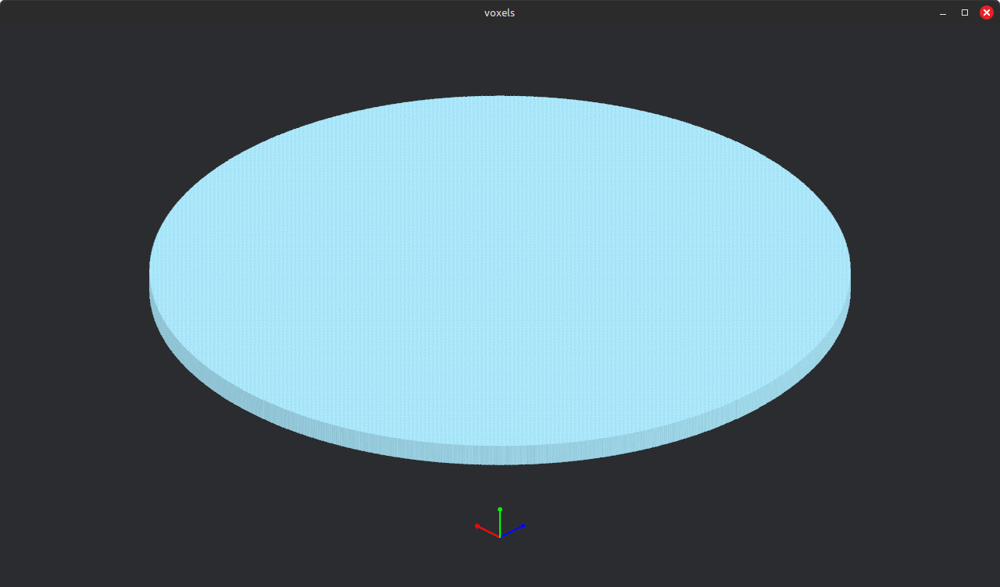
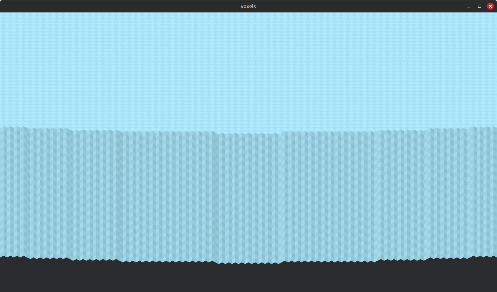

# Voxel Engine: Complete Technical Write-Up

## Overview

This is a custom voxel rendering engine built on top of **Bevy**, the Rust game engine framework. It renders a 3D voxel world (think Minecraft-style blocks) using a heavily optimized pipeline that avoids the naive "one draw call per block" approach. Instead, it uses **greedy meshing**, **instanced rendering**, and **multi-draw indirect** to push many voxels to the GPU in as few draw calls as possible, with the geometry and material data packed tightly into GPU buffers.

The engine is orthographic (no perspective distortion) and uses a custom WGSL shader that reconstructs full 3D geometry from heavily bit-packed instance data at vertex shader time — no traditional vertex mesh per voxel.

---




Above Figure: SDF-based circular platform test. A filled dirt disk 1024 voxels (32 chunks) in diameter and 32 voxels thick, totalling approximately 26.4 million voxels (π × 512² × 32), generated by sampling a cylinder signed distance function at chunk and voxel resolution. Fully interior chunks are spawned as solid filled blocks with no per-voxel sampling; only boundary chunks along the circumference are sampled voxel-by-voxel to produce a smooth circular edge. The entire platform is generated single-threaded in 693ms. The orthographic camera sits at a 45°/30° yaw/pitch angle, giving an isometric view of the greedy-meshed surface. Each visible rectangle on the top face is a single draw instance covering multiple merged voxels — the large uniform interior collapses to very few instances while the scalloped boundary produces more due to the curved edge breaking up merge runs.

## High-Level Architecture

```
Main Thread (Bevy ECS)
 ├── World Data (ChunkData / LinearArray)
 ├── Dirty Marking System
 ├── Greedy Mesher → produces VoxelInstance lists
 └── Staged to ChunkMeshRange

Render World (Bevy Render App)
 ├── Buffer Preparation (upload instances + metadata to GPU)
 ├── Queue System (add draw calls to Transparent3d phase)
 └── DrawMeshInstancedIndirect → multi_draw_indirect on GPU
        ├── Vertex Buffer 0: Quad vertices (4 verts, shared)
        ├── Vertex Buffer 1: VoxelInstance data (per-instance)
        └── Vertex Buffer 2: InstanceMetaBuffer (chunk index + face ID)
```

---

## 1. Data Representation

### `LinearArray` and `OccupancyArray` (`data.rs`)

Each chunk is a **32×32×32** voxel grid. The data is stored in two parallel structures inside `LinearArray`:

- **`data: [u8; 32768]`** — A flat array where each byte is a material ID (0 = Air, 1 = Stone, 2 = Dirt, etc.). The linearization scheme is `index = y | (x << 5) | (z << 10)`, meaning Y is the fastest-changing axis.

- **`occupancy: OccupancyArray`** — A bitset (`[u32; 1024]`) that tracks which cells are non-air. This is what the mesher uses for all its spatial queries — reading the u8 array for material is only done when needed. The bitset enables fast SIMD-friendly iteration via `trailing_zeros` to find the next set bit, and bulk word operations for neighbor queries.

The occupancy count is maintained incrementally so `is_empty()` and `is_full()` are O(1) checks.

### Coordinate System

The voxel index layout `y | x<<5 | z<<10` means:
- Iterating index 0..32768 increments Y every step, X every 32 steps, Z every 1024 steps.
- Neighbor in X direction: word index ± 1 (within the `[u32; 1024]` array)
- Neighbor in Z direction: word index ± 32
- Neighbor in Y direction: bit position ± 1 within the same word

This layout is specifically chosen to make the Y-axis greedy meshing trivial (consecutive bits in a word) and X/Z neighbor lookups cheap (adjacent words).

---

## 2. The Meshing Pipeline

When a chunk is marked dirty, `build_mesh_into()` is called. It produces up to six lists of `VoxelInstance` — one per face direction (YP, YN, XP, XN, ZP, ZN).

### Step 1: Face Extraction (`get_all_faces_simple`)

This is a single pass over all 1024 words in the occupancy array. For each word (representing a column of 32 voxels along Y at a given X,Z position), it computes which voxels have an exposed face in each direction using bitwise operations:

| Face | Operation | Meaning |
|------|-----------|---------|
| YP (top) | `word & !(word >> 1)` | A voxel is set but the one above it is not |
| YN (bottom) | `word & !(word << 1)` | A voxel is set but the one below it is not |
| XP (right) | `word & !(occupancy[i+1])` | Neighbor word in +X is empty |
| XN (left) | `word & !(occupancy[i-1])` | Neighbor word in -X is empty |
| ZP (front) | `word & !(occupancy[i+32])` | Neighbor word in +Z is empty |
| ZN (back) | `word & !(occupancy[i-32])` | Neighbor word in -Z is empty |

The result is six `OccupancyArray` instances where each set bit represents a visible face.

Face directions can be excluded (e.g., back-facing faces from the camera's perspective) to skip meshing entirely for those directions — a simple view-space optimization applied on the CPU.

### Step 2: Primary Greedy Meshing

Three functions handle the primary (1D) greedy meshing pass, one per axis pair:

- **`dgm_y`** — for YP/YN faces: iterates Z×X cells, within each cell sweeps in the X direction to extend runs of same-material voxels at the same Y level.
- **`dgm_x`** — for XP/XN faces: iterates Z×X, sweeps in Y direction (consecutive bits in the same word).
- **`dgm_z`** — for ZP/ZN faces: iterates Z chunks of words, sweeps in Y direction.

Each function clears bits as it consumes them, producing `VoxelInstance` values with a `primary` field encoding how far the face extends in the first axis.

### Step 3: Secondary Greedy Meshing

`secondary_pass_logic` then tries to merge instances across the second axis. For example, a YP face that was extended 4 units in X might be mergeable with an adjacent YP face also extended 4 units in X, combining them into a single 4×N quad.

The logic handles partial overlaps: if one rectangle contains another, the remainder is split into "head" and "tail" pieces and re-queued. This avoids requiring perfect alignment for a merge to happen.

### Output: `VoxelInstance`

Each `VoxelInstance` is a single `u32` with this bit layout:

```
Bits  0- 4:  Y position within chunk (5 bits, 0-31)
Bits  5- 9:  X position within chunk (5 bits, 0-31)
Bits 10-14:  Z position within chunk (5 bits, 0-31)
Bits 15-19:  Primary extent (5 bits, 0-31) — how far the face extends in axis A
Bits 20-24:  Secondary extent (5 bits, 0-31) — how far the face extends in axis B
Bits 25-31:  Material ID (7 bits, 0-127)
```

This is the core data the vertex shader unpacks to reconstruct the full quad geometry — no separate vertex mesh per voxel exists.

---

## 3. GPU Buffer Management (`buffers.rs`)

### Global Buffer Pool (`GlobalBufferPool` / `VoxelInstancePool`)

All chunk instance data shares a single large GPU vertex buffer. The pool uses a simple first-fit allocator (`RangeAllocator`) that tracks free ranges as `(offset, size)` pairs and merges adjacent free ranges on deallocation.

Allocations are 256-byte aligned. Each chunk gets a `BufferRange` recording where its data lives within the shared buffer.

### Per-Chunk State (`ChunkMeshRange`)

Each chunk entity has a `ChunkMeshRange` component that manages its GPU lifecycle:

- **Staged data** — newly computed `VoxelInstance` list waiting to be uploaded
- **Current range** — the active allocation being used for rendering this frame
- **Next range** — the new allocation uploaded this frame, not yet swapped in
- **Cleanup queue** — old ranges that need deallocation after the GPU is done with them (delayed by 3 frames for triple-buffering safety)
- **Face offsets/sizes** — within the chunk's allocation, where each face direction's data starts and how many instances it has

The swap from `next_range` to `current_range` is atomic with respect to the face layout — both the buffer range and the face metadata are swapped together.

### Metadata Buffer (`InstancedMeta`)

A second GPU vertex buffer runs in parallel with the instance buffer. For every `VoxelInstance` slot, there is a corresponding `InstanceMetaBuffer` entry containing:
- The **chunk index** (packed x,y,z chunk coordinates in a u32)
- The **face ID** (0-5, indicating which of the six face directions this instance belongs to)

This is necessary because many chunks share one draw call, and the vertex shader needs to know which chunk each instance came from to offset it to world space.

### `MultiDrawBuffer`

A CPU-side list of `DrawIndirectCommand` structs (vertex_count, instance_count, first_vertex, first_instance), one per non-empty face of each chunk. This is uploaded to a GPU buffer each frame and consumed by `multi_draw_indirect`, issuing all draw calls in a single GPU command.

---

## 4. The Rendering Pipeline (`pipeline.rs`)

### Pipeline Setup

The `VoxelPipeline` uses Bevy's `Variants<RenderPipeline, VoxelSpecializer>` system. The specializer configures:
- **Vertex buffers**: three layouts — quad positions (Vertex step), instance data (Instance step), instance metadata (Instance step)
- **Depth testing**: `Greater` (reversed-Z for precision)
- **Primitive topology**: `TriangleStrip` — the shared quad mesh is just 4 vertices with indices [0,1,2,3], enough to draw any size rectangle
- **MSAA / HDR**: determined at specialization time from the view's pipeline key

Before building the pipeline, `write_shader_with_constants()` reads `voxel_base.wgsl` and prepends auto-generated constants (`CHUNK_SIZE`, `CHUNK_AXIS_BITS`, etc.) to produce `instancing.wgsl`. This keeps chunk configuration in one Rust place (`chunk_config`) without duplicating it in WGSL.

### Systems

**Main thread:**

- **`remesh_dirty`** — Queries all `Dirty` chunks, calls the mesher, stages results into `ChunkMeshRange`, removes the `Dirty` marker. Also calls `get_backfacing_faces` using the camera transform to exclude faces pointing away from the viewer before meshing, skipping geometry that will never be seen.

**Render world:**

- **`prepare_buffers`** — For every chunk, uploads staged instance data to the shared GPU pool, writes metadata to the SSBO, and appends draw commands to `MultiDrawBuffer`. Also triggers cleanup of old allocations. Finally uploads the draw command list to its GPU buffer.

- **`queue_custom`** — Adds each chunk mesh to the `Transparent3d` render phase so it participates in the render pass.

- **`DrawMeshInstancedIndirect`** — The actual render command. It binds the three vertex buffers and calls `multi_draw_indirect` once, covering every face of every visible chunk.

---

## 5. The Vertex Shader (`voxel_base.wgsl`)

The shader receives:
- `position`: one of four quad corner vertices `(0,0,0), (1,0,0), (0,0,1), (1,0,1)` — a unit quad in the XZ plane
- `instance`: the packed `VoxelInstance` u32
- `chunk_index`: the packed chunk coordinates u32
- `face`: 0-5 indicating the face direction

**Geometry reconstruction:**

1. Unpack local position (x,y,z within chunk), primary extent, secondary extent, and material from `instance`.
2. Unpack chunk world position from `chunk_index` (multiply by CHUNK_SIZE).
3. Apply greedy extensions to the quad: if `position.x == 1.0`, add `len_a`; if `position.z == 1.0`, add `len_b`. This turns the unit quad into a rectangle of the correct size.
4. Rotate the quad into the correct orientation based on face direction:
   - YP/YN: no rotation (already in XZ plane)
   - XP/XN: swap X and Y axes
   - ZP/ZN: rotate XYZ → ZXY
5. Set the face's offset (e.g., YP face sits at `y = 1.0`, XP at `x = 1.0`)
6. Translate by local voxel position and chunk world position.

**Lighting:**

A simple per-face brightness multiplier (`FACE_BRIGHTNESS`) fakes ambient occlusion-style directional shading: top faces are brightest (1.0), bottom faces darkest (0.55), sides in between.

**Fragment shader:**

A checker pattern (`(floor(u) + floor(v)) % 2`) derived from world-space UVs adds a subtle ±10% brightness variation at voxel resolution, giving the surface a slight texture without any texture atlas.

---

## 6. Coordinate Systems and Indexing (`index.rs`, `base.rs`)

### `ChunkIndex`

A 30-bit packed chunk coordinate: `y | (x << 10) | (z << 20)`. Each axis gets 10 bits, allowing up to 1024 chunks per axis. The shader unpacks this the same way, multiplying by `CHUNK_SIZE` to get the world-space origin.

### `ArrayIndex3d<MAX_X, MAX_Y, MAX_Z>`

A generic const-generic index type used for type-safe voxel addressing. The bit layout is `y | (x << Y_BITS) | (z << (Y_BITS + X_BITS))`. Provides typed `with_x`, `with_y`, `with_z`, `next_in_direction`, and `step_in_direction` methods with compile-time bounds checking.

`VoxelIndex` is a wrapper around this type specialized to `32×32×32`.

`ArrayHeightmapIndex3d` is a reduced index with Y removed, useful for heightmap lookups.

---

## 7. Camera (`camera.rs`)

The camera uses an **orthographic projection** with `FixedVertical` scaling mode, giving an isometric-style view without perspective distortion. It is positioned at a 45°/30° yaw/pitch angle looking at the origin chunk.

Controls:
- **WASD** — pans camera and focal point together (preserves viewing angle)
- **Space / Left Shift** — moves camera up/down only (tilts the view angle)
- **Mouse scroll** — zooms via `orthographic.scale`

The camera always calls `looking_at(focal_point)` after movement to keep the focal point centered.

---

## 8. Chunk Entity Structure

Each chunk is a Bevy entity with this component bundle (`Chunk`):
- `Mesh3d` — handle to the shared quad mesh (all chunks use the same 4-vertex mesh)
- `ChunkData` (alias for `LinearArray`) — the voxel data
- `ChunkIndex` — the chunk's world coordinates, extracted to the render world
- `ChunkMeshRange` — GPU buffer allocation state
- `Dirty` — marker component; presence triggers remeshing
- `NoFrustumCulling` — disables Bevy's built-in frustum culling (the engine manages its own via face exclusion)

---

## 9. Performance and Efficiency

This engine is designed around the idea that every layer of the stack — data layout, meshing algorithm, CPU→GPU transfer, and the GPU draw call itself — should be as cheap as possible. The optimizations compound: a faster mesher means fewer instances, fewer instances means a smaller GPU upload, and a smaller upload means the single `multi_draw_indirect` finishes faster.

### CPU-Side: Meshing Performance

The meshing benchmarks in `data.rs` reveal what this pipeline actually costs on hardware. Running 1000 iterations of `build_mesh_into` on a 32³ chunk:

| Pattern | Time | Instances | Notes |
|---------|------|-----------|-------|
| Empty (all air) | **1ns** | 0 | Early exit via occupancy count |
| Uniform (solid stone) | **18µs** | 6 | Early exit, one max-size instance per face |
| Hollow cube (1 voxel walls) | **21µs** | 12 | Thin surface, excellent merge ratio |
| Hollow cube (2 voxel walls) | **21µs** | 12 | Same instance count — greedy merges the extra layer |
| Sphere (radius 8) | **20µs** | 750 | Curved surface limits merging |
| Sphere (radius 15) | **31µs** | 2,398 | Larger surface area, more instances |
| Pillars (spacing 8) | **15µs** | 96 | Very sparse, fast |
| Pillars (spacing 4) | **20µs** | 384 | Denser but still merges well |
| 3D Noise (scale 8, threshold 0.5) | **23µs** | 400 | Large blobs, merges well |
| 3D Noise (scale 4, threshold 0.3) | **32µs** | 1,504 | Finer noise, more exposed faces |
| Y-banded (horizontal planes) | **38µs** | 2,080 | Alternating solid/air layers |
| X-banded / Z-banded | **38–42µs** | 96 | Vertical slabs, merges across full axis |
| Dense random (90%, 4 materials) | **99µs** | 21,140 | Material variety kills merging |
| Sparse random (10% fill) | **91µs** | 15,871 | Isolated voxels, no merging possible |
| Sparse random (50% fill) | **276µs** | 36,484 | Peak instance count around 50% fill |
| Checkerboard (worst case) | **322–341µs** | 98,304 | Every voxel isolated across all 3 axes |

The component breakdown for a typical dense chunk (sphere, radius 12) shows where time goes:

| Stage | Time | % of total |
|-------|------|-----------|
| Face extraction | 7.1µs | 31% |
| Primary pass (1D greedy) | 10.3µs | 45% |
| Secondary pass (2D merge) | 5.9µs | 26% |
| **Full pipeline** | **23µs** | 100% |

Several patterns from this data are worth highlighting:

**The checkerboard is pathological, not representative.** At 322µs and 98,304 instances, it is the absolute theoretical worst case — every voxel is surrounded by air on all sides and by a different material diagonally, so zero merging is possible. No naturally generated terrain looks like this. A dense sphere at radius 15 (31µs, 2,398 instances) is far closer to what real terrain costs.

**Face exclusion is a genuine speedup, not cosmetic.** Excluding 3 of 6 face directions on the checkerboard (the worst case) drops time from 311µs to 149µs — a **2× speedup** just by skipping the back-facing directions. In normal gameplay where the camera has a fixed orientation, 2–3 face directions are typically always excluded, making the effective meshing cost significantly lower than the full-pipeline numbers above.

**The fill ratio curve peaks at 50%.** Meshing time is highest around 40–50% fill (276µs) and falls off sharply at both extremes. At 99% fill (37µs, 2,197 instances) the greedy mesher produces enormous merged quads, almost like the uniform case. At 5% fill (71µs, 8,969 instances) most voxels are isolated but there are fewer of them. The worst case is the middle — many voxels, poor merge opportunities.

**Why meshing is fast:**

- The occupancy bitset is only 4KB (1024 × u32). It fits entirely in L1 cache on almost any modern CPU. The entire face extraction pass reads 4KB and writes 6×4KB — all cache-resident, which is why face extraction costs just 7µs.
- `trailing_zeros()` is a single hardware instruction (BSF/TZCNT on x86, CLZ on ARM). The innermost meshing loops are effectively `while word != 0 { let bit = word.trailing_zeros(); ... word &= word - 1; }` — the canonical fast bitset iteration pattern.
- The `is_uniform()` check processes the 32KB material array 8 bytes at a time using `u64` comparison. If the chunk is all one material (very common for deep underground stone or air above the surface), the entire mesh completes in 1ns for air and ~18µs for solid — one instance per face, no loop needed.
- `build_mesh_into()` reuses a `TempChunkMeshData` buffer across calls (`Vec::clear()` retains allocation), so no heap allocation occurs during steady-state meshing.

### The Bitset Layout Pays Off in the Mesher

The choice of `y | (x<<5) | (z<<10)` linearization means:

- **Y neighbors** are consecutive bits in the same u32. The YP face mask `word & !(word >> 1)` is two operations to process an entire 32-voxel column simultaneously. No loop, no conditional, no branch.
- **X neighbors** are consecutive words (`i±1`). The XP/XN face masks read the next/previous word with zero index arithmetic.
- **Z neighbors** are 32 words apart (`i±32`). Same pattern, slightly larger stride but still sequential memory.

A naive 3D loop checking each voxel's 6 neighbors individually would be ~196,000 comparisons per chunk (32³ × 6). The bitwise approach does it in 1024 word operations — about 192× fewer operations, and they're wider (32-bit words vs 1-bit checks).

### GPU-Side: Draw Call Efficiency

The most expensive thing a CPU can do in real-time graphics is issue draw calls. Each call has fixed overhead on both the CPU (driver validation, command encoding) and GPU (pipeline state change, descriptor binding). For a naive voxel renderer that issues one draw call per visible face, a single fully-visible chunk with 3000 exposed faces would require 3000 draw calls per frame — the GPU would spend most of its time doing bookkeeping, not rasterizing.

This engine collapses the entire world into **one** `multi_draw_indirect` call per frame. The GPU reads an array of `DrawIndirectCommand` structs from a buffer and executes them all in sequence without any CPU involvement. For N chunks each with up to 6 face directions, the CPU overhead is O(1) GPU calls regardless of chunk count.

The cost breakdown per chunk per frame in the render world is:
- One `write_buffer` call to upload instance data (only on dirty chunks; clean chunks pay nothing)
- One `write_buffer` call to update metadata (same)
- Appending up to 6 `DrawIndirectCommand` structs to a Vec (pure CPU, ~24 bytes each)

The final `upload()` of that Vec is one `write_buffer` call for the entire frame.

### Memory Bandwidth

Each `VoxelInstance` is 4 bytes. A chunk with 1000 visible face instances uses 4KB of GPU vertex buffer. The GPU reads these at vertex fetch time — 4 bytes per instance, 4 instances per quad = 16 bytes per face quad drawn. The vertex shader then does integer bit-unpacking (shifts and masks) to reconstruct all geometry. There is no position buffer, no normal buffer, no UV buffer, no index buffer beyond the shared 4-vertex quad. The 4-byte instance carries everything.

Compare this to a naive approach where each face is a separate mesh with 4 vertices, each vertex storing a `vec3` position (12 bytes) + `vec2` UV (8 bytes) + `vec3` normal (12 bytes) = 32 bytes per vertex × 4 vertices = 128 bytes per face. The instanced approach is **32× more memory-efficient** per face at the GPU vertex fetch stage, before considering that greedy meshing reduces face count further by merging rectangles.

For a 32×32×32 solid chunk: a naive renderer would produce 6 × 32² = 6144 faces on the surface alone (and many more for interior faces if not occluded). After greedy meshing, a uniform solid chunk produces exactly **6 instances** — one per face direction, each a 32×32 quad. That's 6 × 4 bytes = 24 bytes total on the GPU, covering the entire visible surface of the chunk.

### The Shared Buffer and Cache Coherency

All chunk instances living in one contiguous GPU buffer means vertex fetches for a single `multi_draw_indirect` sweep are reading sequentially through a single memory region. The GPU's vertex cache and memory prefetcher work well on sequential access patterns. Fragmentation of the buffer (from dynamic allocation/deallocation) can create gaps, but the range allocator merges adjacent free blocks to limit this.

The 256-byte alignment constraint on allocations ensures each chunk's data starts on a cache-line-friendly boundary, avoiding false sharing between chunks in the GPU's memory subsystem.

### Dirty-Only Remeshing

Meshing only happens when a chunk has the `Dirty` marker component. Bevy's ECS `With<Dirty>` query is a set intersection — it only iterates entities that actually have the component. In a static world, zero chunks are dirty each frame and `remesh_dirty` does nothing. In a world where the player modifies one block, exactly one (or at most a few neighboring) chunks get remeshed that frame.

This means the meshing cost scales with *change rate*, not *world size*. A 256×256×256 voxel world (512 chunks) with no modifications has zero meshing cost. Adding a block in one chunk costs one chunk's remesh time (~5–25µs for typical terrain).

### What Doesn't Scale (Yet)

The current design has some known scaling limits worth noting:

- **`prepare_buffers` iterates all chunks every frame** — even clean chunks need to be checked to issue their draw commands. As chunk count grows, this loop grows linearly. A future optimization would maintain a persistent draw command buffer and only update entries for dirty chunks.
- **Face direction culling, not chunk frustum culling** — `get_backfacing_faces` removes entire face directions from the mesher based on the camera view vector (e.g. top faces when looking straight down, bottom faces in normal play). This is meaningful — skipping a face direction cuts meshing work by ~16% per excluded direction and eliminates those instances from the GPU entirely. However, it operates at the face-direction level, not the chunk level. `NoFrustumCulling` is explicitly set on every chunk entity, meaning chunks that are completely outside the camera frustum still get meshed and drawn. For an orthographic isometric view where much of the world is always on-screen this matters less, but a large open world would benefit from chunk-level frustum rejection.
- **The range allocator is first-fit** — under heavy dynamic modification, the free list can fragment. A more sophisticated allocator (slab, buddy system) would perform better under churn.
- **No LOD (Level of Detail)** — distant chunks are rendered at full detail. A chunked LOD system would dramatically reduce instance counts for far terrain.

---

## 10. Key Design Decisions and Trade-Offs

| Decision | Rationale |
|----------|-----------|
| Single shared GPU buffer for all instances | Minimizes draw calls; one multi_draw_indirect covers everything |
| Greedy meshing in 2 passes (1D then 2D) | Balances simplicity and compression; pure 2D greedy requires backtracking |
| Y as fastest-changing axis in linearization | Makes Y-direction bit operations natural (consecutive bits in one word) |
| Pack everything into one u32 per VoxelInstance | Minimal GPU bandwidth; vertex shader unpacks at no memory cost |
| Orthographic camera | Isometric aesthetic; also avoids perspective-divide issues in frustum culling |
| No texture atlas | Procedural colors and checker noise in the shader; simpler pipeline, no UV layout concerns |
| Face exclusion from camera direction | Skips meshing geometry that faces away from camera; significant savings for opaque terrain |
| 3-frame deferred deallocation | Prevents race condition where GPU is still reading data being freed |
| Shader constants auto-generated at startup | Single source of truth in Rust's `chunk_config`; WGSL gets correct values without manual syncing |